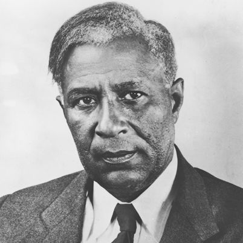

## Garrett Morgan

# Гаррет Морган вместе со своими пациентами проложил путь афроамериканским изобретателям, в том числе для средства для выпрямления волос, дыхательного аппарата, обновленной швейной машинки и улучшенного светофора

#  

(1877-1963)

## Кто такой Гаррет Морган?

Имея лишь начальное школьное образование, Гаррет Морган начал свою карьеру в качестве механика швейной машины. Затем он запатентовал несколько изобретений, в том числе усовершенствованную швейную машинку и светофор, средство для выпрямления волос и дыхательное устройство, которое позже послужило основой для создания противогазов времен Первой мировой войны. Изобретатель умер 27 июля 1963 года в Кливленде, штат Огайо.